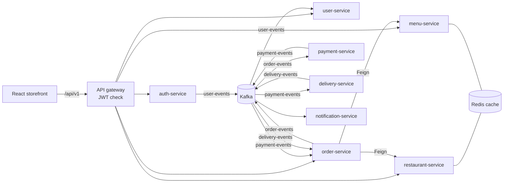

# FoodieHub

[](https://github.com/Manasdbg123/food_delivery/actions/workflows/ci.yml)

A food delivery platform built as **ten Spring Boot microservices** behind an API
gateway, talking over **Kafka**, with a **React** storefront. Browse restaurants in
five cities, build a cart, check out with a coupon, and watch the order move from
payment to the kitchen to your door.

The frontend also runs **on its own**: with no backend it falls back to a bundled
sample catalogue and a clearly labelled demo mode, so the whole flow can be tried
from `npm run dev` alone.

---

## Features

| | |
|---|---|
| **Browse** | Restaurants by city, cuisine chips, sorting (rating, delivery time, cost) and filters (pure veg, 4.5+, under 30 min, offers). Browsing needs no account. |
| **Menus** | Grouped by section with bestsellers, veg marks, a menu search and a veg-only toggle. Inline quantity steppers and a sticky "view cart" bar. |
| **Search** | Dishes and restaurants across the selected city. |
| **Checkout** | Delivery address, UPI / card / cash on delivery, coupon codes, and a full bill (delivery fee, platform fee, 5% GST). |
| **Order tracking** | A live stepper that polls order-service: placed → confirmed → preparing → on the way → delivered. Cancel while the kitchen has not started. |
| **Account** | Order history with reorder, and editable profile details. |
| **Also** | Offers page, Dineout table booking, a searchable help centre, responsive down to phone width. |

## Architecture



**How an order moves**

1. `POST /api/v1/orders` — order-service looks up the restaurant and every item
   through Feign, prices the order server-side (client prices are never trusted),
   saves it as `CREATED` and publishes `ORDER_CREATED`.
2. payment-service charges it and publishes `PAYMENT_SUCCESS` → order becomes `ACCEPTED`.
3. delivery-service starts a delivery and publishes `PREPARING`, then
   `OUT_FOR_DELIVERY`, then `DELIVERED` on a timer (configurable with
   `delivery.prep-seconds` / `delivery.ride-seconds`).
4. order-service applies each status only if it moves the order *forward*, so a late
   or duplicated event can never rewind an order or revive a cancelled one.

**Security.** The gateway verifies the JWT and forwards the caller as `X-User-Id`.
It strips any client-sent copy of that header first, and matches public routes by
whole path prefix. Every order read and write is scoped to the caller; someone else's
order returns 404.

| Service | Port | Responsibility |
|---|---|---|
| discovery-server | 8761 | Eureka registry |
| api-gateway | 8080 | Routing, JWT verification |
| auth-service | 8081 | Register, sign in, issue JWTs |
| user-service | 8082 | Profiles (`GET`/`PUT /users/me`) |
| restaurant-service | 8083 | Restaurants by city (Redis-cached) |
| menu-service | 8084 | Menus (Redis-cached) |
| order-service | 8085 | Orders, pricing, coupons, status |
| payment-service | 8086 | Payments |
| delivery-service | 8087 | Delivery lifecycle |
| notification-service | 8088 | Notifications |

## Running it

### Frontend only (no backend needed)

```bash
cd frontend
npm install
npm run dev          # http://localhost:5173
```

Sign in shows **Continue with the demo account** when the backend is not running.
Demo orders are stored in your browser and move through every status on a timer.

### Full stack with Docker

```bash
cd infrastructure
MYSQL_ROOT_PASSWORD=choose-one docker compose up --build
cd ../frontend && npm install && npm run dev
```

The Vite dev server proxies `/api` to the gateway on port 8080. Restaurants and menus
are seeded on first start, with the same 15 restaurants the sample catalogue shows.

### Configuration

| Variable | Used by | Default |
|---|---|---|
| `DB_URL`, `DB_USERNAME`, `DB_PASSWORD` | services with a database | local MySQL, `root` / `password` |
| `MYSQL_ROOT_PASSWORD` | docker compose | `password` |
| `JWT_SECRET` | auth-service, api-gateway | a development key — **set your own** |
| `KAFKA_BOOTSTRAP_SERVERS` | all services | `localhost:9092` |
| `EUREKA_URI` | all services | `http://localhost:8761/eureka/` |

Run any service with `--spring.profiles.active=local` to use a file-based H2
database under `.local-infra/data/` instead of MySQL.

## Tests

```bash
mvn verify                       # all services
cd frontend && npm run build     # frontend production build
```

Covered: gateway route access (including the path-bypass case), order pricing and
coupons, order status transitions, placing / cancelling / reading orders with mocked
Feign clients, the delivery lifecycle with a fixed clock, and Redis cache round trips.
CI runs both on every pull request.

## API

| Method | Path | Auth | |
|---|---|---|---|
| `POST` | `/api/v1/auth/register` | – | Create an account |
| `POST` | `/api/v1/auth/login` | – | Returns `{ token, user }` |
| `GET` | `/api/v1/restaurants?city=` | – | Open restaurants in a city |
| `GET` | `/api/v1/restaurants/{id}` | – | One restaurant |
| `GET` | `/api/v1/menus/restaurant/{id}` | – | Available menu items |
| `GET` / `PUT` | `/api/v1/users/me` | JWT | Your profile |
| `POST` | `/api/v1/orders` | JWT | `{ restaurantId, items: [{ menuItemId, quantity }], deliveryAddress, paymentMethod, couponCode }` |
| `GET` | `/api/v1/orders/me` | JWT | Your orders, newest first |
| `GET` | `/api/v1/orders/{id}` | JWT | One of your orders |
| `POST` | `/api/v1/orders/{id}/cancel` | JWT | Cancel before the kitchen starts |
