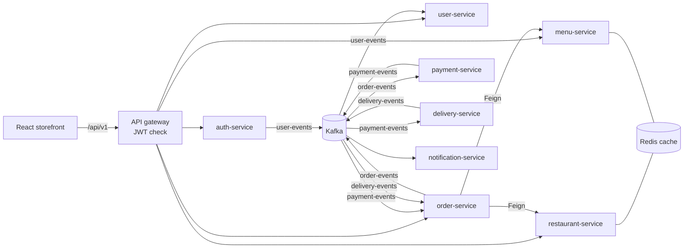

# FoodieHub

[](https://github.com/Manasdbg123/food_delivery/actions/workflows/ci.yml)

A food delivery platform built as **ten Spring Boot microservices** behind an API
gateway, talking over **Kafka**, with a **React** storefront. Browse restaurants in
five cities, build a cart, check out with a coupon, and watch the order move from
payment to the kitchen to your door.

The frontend also runs **on its own**: with no backend it falls back to a bundled
sample catalogue and a clearly labelled demo mode, so the whole flow can be tried
from `npm run dev` alone.

---

## Features

| | |
|---|---|
| **Browse** | Restaurants by city, cuisine chips, sorting (rating, delivery time, cost) and filters (pure veg, 4.5+, under 30 min, offers). Browsing needs no account. |
| **Menus** | Grouped by section with bestsellers, veg marks, a menu search and a veg-only toggle. Inline quantity steppers and a sticky "view cart" bar. |
| **Search** | Dishes and restaurants across the selected city. |
| **Checkout** | Delivery address, coupon codes and a full bill (delivery fee, platform fee, 5% GST). Pay online through **Stripe Checkout** or choose cash on delivery. |
| **Payments** | The kitchen starts only after Stripe's signed webhook confirms the payment. Cancelling refunds automatically, and an abandoned payment can be resumed from the order page. |
| **Order tracking** | A live stepper that polls order-service: placed → confirmed → preparing → on the way → delivered. Cancel while the kitchen has not started. |
| **Account** | Order history with reorder, and editable profile details. |
| **Also** | Offers page, Dineout table booking, a searchable help centre, responsive down to phone width. |

## Architecture



**How an order moves**

1. `POST /api/v1/orders` — order-service looks up the restaurant and every item
   through Feign, prices the order server-side (client prices are never trusted),
   saves it as `CREATED` and publishes `ORDER_CREATED`.
2. payment-service settles it. Cash on delivery is accepted at once. An online payment
   waits for the customer to pay on Stripe Checkout (`POST /api/v1/payments/checkout`)
   and for Stripe's signed webhook to confirm it. Then `PAYMENT_SUCCESS` is published
   and the order becomes `ACCEPTED`. An expired checkout publishes `PAYMENT_FAILED`.
3. delivery-service starts a delivery and publishes `PREPARING`, then
   `OUT_FOR_DELIVERY`, then `DELIVERED` on a timer (configurable with
   `delivery.prep-seconds` / `delivery.ride-seconds`).
4. order-service applies each status only if it moves the order *forward*, so a late
   or duplicated event can never rewind an order or revive a cancelled one.

**Security.** The gateway verifies the JWT and forwards the caller as `X-User-Id`.
It strips any client-sent copy of that header first, and matches public routes by
whole path prefix. Every order read and write is scoped to the caller; someone else's
order returns 404.

| Service | Port | Responsibility |
|---|---|---|
| discovery-server | 8761 | Eureka registry |
| api-gateway | 8080 | Routing, JWT verification |
| auth-service | 8081 | Register, sign in, issue JWTs |
| user-service | 8082 | Profiles (`GET`/`PUT /users/me`) |
| restaurant-service | 8083 | Restaurants by city (Redis-cached) |
| menu-service | 8084 | Menus (Redis-cached) |
| order-service | 8085 | Orders, pricing, coupons, status |
| payment-service | 8086 | Stripe Checkout, webhooks, refunds |
| delivery-service | 8087 | Delivery lifecycle |
| notification-service | 8088 | Notifications |

## Running it

### Frontend only (no backend needed)

```bash
cd frontend
npm install
npm run dev          # http://localhost:5173
```

Sign in shows **Continue with the demo account** when the backend is not running.
Demo orders are stored in your browser and move through every status on a timer.

### Full stack with Docker

```bash
cd infrastructure
cp .env.example .env        # set MYSQL_ROOT_PASSWORD and JWT_SECRET (openssl rand -base64 48)
docker compose up -d --build
```

Open http://localhost. nginx serves the storefront and proxies `/api` to the gateway.
Restaurants and menus are seeded on first start, with the same 15 restaurants the
sample catalogue shows. The first build compiles all ten services and takes a few minutes.

For frontend work against the running stack, `cd frontend && npm run dev` also works.
The Vite dev server proxies `/api` to the gateway on `localhost:8080`.

## Payments

Payments run in one of two modes, set by `PAYMENT_PROVIDER`:

| Mode | What happens |
|---|---|
| `simulated` (default) | Online payments are approved instantly. Nothing to set up; good for demos. |
| `stripe` | The customer is sent to Stripe Checkout. The order is confirmed only when Stripe's signed webhook says the payment succeeded. |

**How a Stripe payment works**

1. Placing an online order saves it as `CREATED`, and the storefront calls
   `POST /api/v1/payments/checkout`. payment-service reads the order *as that customer*
   from order-service, so the amount is the server-priced total and someone else's
   order returns 404. It then opens a Stripe Checkout session that stays payable for 30 minutes.
2. The customer pays on Stripe's page; card details never reach FoodieHub.
3. Stripe calls `POST /api/v1/payments/webhook`. The gateway lets that one path through
   without a token. payment-service checks the `Stripe-Signature` over the raw body,
   then publishes `PAYMENT_SUCCESS`, and the kitchen starts.
4. If the customer backs out, the order page shows **Pay now** (it reuses the open
   session) and **Cancel**. Cancelling expires the session. A payment that still
   lands after cancelling is refunded automatically, as is cancelling a paid order.

Webhook handling is idempotent: Stripe's retries, duplicate events and the expiry of a
replaced session change nothing.

**Setting up Stripe**

1. Get your test keys from the Stripe dashboard (Developers → API keys).
2. Add a webhook endpoint at `https://<your domain>/api/v1/payments/webhook` for the
   events `checkout.session.completed`, `checkout.session.async_payment_succeeded`,
   `checkout.session.async_payment_failed` and `checkout.session.expired`, and copy
   its signing secret.
3. In `infrastructure/.env` set `PAYMENT_PROVIDER=stripe`, `STRIPE_SECRET_KEY`,
   `STRIPE_WEBHOOK_SECRET` and `PUBLIC_URL`, the address Stripe returns customers to.
   payment-service refuses to start in Stripe mode if any of them is missing.

To test locally without a public URL, use the Stripe CLI. It prints a `whsec_...`
secret to use as `STRIPE_WEBHOOK_SECRET`:

```bash
stripe listen --forward-to localhost:8080/api/v1/payments/webhook
```

Pay with the test card `4242 4242 4242 4242`, any future date and any CVC.

## Deploying

The Docker setup is production-shaped: every service has a health check, a restart
policy and a memory limit, and it runs as a non-root user. Only the storefront port is
public; MySQL, Kafka, Eureka and the gateway listen on `127.0.0.1` only.

**On a single server** (about 6 GB of RAM for all ten services plus MySQL and Kafka):

```bash
git clone https://github.com/Manasdbg123/food_delivery.git && cd food_delivery/infrastructure
cp .env.example .env   # secrets, PUBLIC_URL, Stripe keys
# HTTPS with automatic Let's Encrypt certificates via the bundled Caddy:
#   DOMAIN=food.example.com  PUBLIC_URL=https://food.example.com
#   HTTP_BIND=127.0.0.1      HTTP_PORT=8000
docker compose --profile tls up -d --build
```

Point the domain's DNS at the server first, so Caddy can get a certificate. Stripe
needs HTTPS for live-mode webhooks.

**Storefront only** (demo mode, free hosting). The `frontend/` folder deploys as-is to
Vercel: `vercel.json` handles client-side routes. With no API configured it runs on the
bundled sample catalogue. To connect it to a backend hosted elsewhere, set
`VITE_API_URL` at build time and add the storefront's origin to `CORS_ALLOWED_ORIGINS`.

### Configuration

Set these in `infrastructure/.env` (see `.env.example`):

| Variable | Used by | Default |
|---|---|---|
| `MYSQL_ROOT_PASSWORD` | MySQL and every service with a database | **required** |
| `JWT_SECRET` | auth-service, api-gateway | **required**: base64, 32+ bytes |
| `PUBLIC_URL` | payment-service (Stripe return address) | `http://localhost` |
| `PAYMENT_PROVIDER` | payment-service | `simulated` |
| `STRIPE_SECRET_KEY`, `STRIPE_WEBHOOK_SECRET` | payment-service | needed when `PAYMENT_PROVIDER=stripe` |
| `PAYMENT_CURRENCY` | payment-service | `inr` |
| `HTTP_BIND`, `HTTP_PORT` | storefront container | `0.0.0.0`, `80` |
| `DOMAIN` | Caddy (`--profile tls`) | — |
| `CORS_ALLOWED_ORIGINS` | api-gateway | none (same-origin) |
| `VITE_API_URL` | frontend build | same origin |

Outside Docker, services also read `DB_URL`, `DB_USERNAME`, `DB_PASSWORD`,
`KAFKA_BOOTSTRAP_SERVERS` (default `localhost:9092`) and `EUREKA_URI` (default
`http://localhost:8761/eureka/`). Run any service with `--spring.profiles.active=local`
to use a file-based H2 database under `.local-infra/data/` and a development JWT key.
Without the `local` profile there is no default JWT key, so a deployment can never
start with a publicly known one.

## Tests

```bash
mvn verify                       # all services
cd frontend && npm run build     # frontend production build
```

Covered: gateway route access (including the path-bypass case and the public Stripe
webhook), payments (checkout amounts and ownership, webhook signatures verified exactly
as Stripe signs them, idempotent retries, refunds on cancellation), order pricing and
coupons, order status transitions, placing / cancelling / reading orders with mocked
Feign clients, the delivery lifecycle with a fixed clock, and Redis cache round trips.
CI runs both on every pull request, validates the compose file and builds the Docker images.

## API

| Method | Path | Auth | |
|---|---|---|---|
| `POST` | `/api/v1/auth/register` | – | Create an account |
| `POST` | `/api/v1/auth/login` | – | Returns `{ token, user }` |
| `GET` | `/api/v1/restaurants?city=` | – | Open restaurants in a city |
| `GET` | `/api/v1/restaurants/{id}` | – | One restaurant |
| `GET` | `/api/v1/menus/restaurant/{id}` | – | Available menu items |
| `GET` / `PUT` | `/api/v1/users/me` | JWT | Your profile |
| `POST` | `/api/v1/orders` | JWT | `{ restaurantId, items: [{ menuItemId, quantity }], deliveryAddress, paymentMethod, couponCode }` |
| `GET` | `/api/v1/orders/me` | JWT | Your orders, newest first |
| `GET` | `/api/v1/orders/{id}` | JWT | One of your orders |
| `POST` | `/api/v1/orders/{id}/cancel` | JWT | Cancel before the kitchen starts; refunds if already paid |
| `POST` | `/api/v1/payments/checkout` | JWT | `{ orderId }` → `{ provider, status, checkoutUrl }` |
| `GET` | `/api/v1/payments/order/{orderId}` | JWT | Payment status for one of your orders |
| `POST` | `/api/v1/payments/webhook` | Stripe signature | Stripe events |
